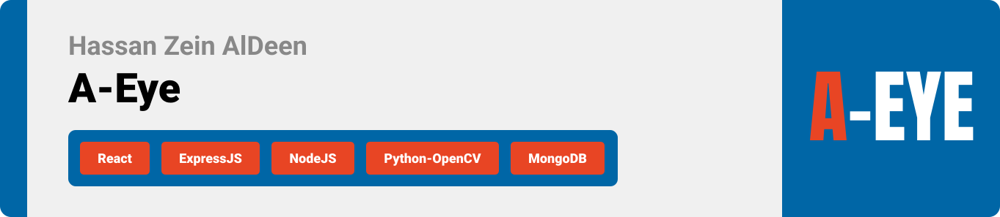
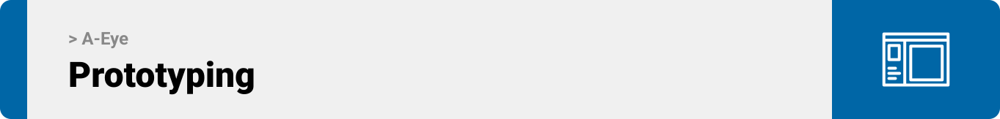
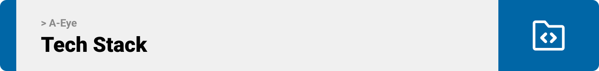

<br><br>

<!-- project philosophy -->


> Introducing A-EYE, An AI screen that analyzes customers' appearence, age and gender to enable stores in a mall to display targeted advertisements. In this setup, a camera analyzes facial features to determine which advertisements should be shown, and then those advertisements are displayed on a screen, This process is regularly repeated within a predefined timeframe. Stores will request these advertisements to admin on a website in order to be approved and then displayed on the screen, and they will be updated there on a regular basis. In addition, AI may assist store owners in developing promotional strategies for a certain time frame.

>  Our project is driven by the mission to innovate advertising in malls by providing precise targeting through cutting-edge facial recognition technology. By analyzing the faces of individuals in the mall, we aim to deliver targeted and relevant advertisements, creating a more personalized and engaging shopping experience.

### User Stories
- As a User, I want to apply for a new account for my shop.

### Shop Owner Stories
- As a shop owner, I want to create advertisements and specify the target gender and age to enhance the efficiency of my ads.
- As a shop owner, I want to show advertisements after analyzing the face of a specific mall visitor, so that the running advertisements will be specific and targeted.
- As a shop owner, I want to see all archived advertisements, so that I can request and run it whenever I want.
- As a shop owner, I want my requests to be thoroughly reviewed by admin, so that I ensure the optimal display of advertisements on the screen.
- As a shop owner, I want to receive timely messages from the admin, particularly reminders for special occasions and important notes related to my ads, including both rejections and approvals.


### Admin Stories
- As an admin, I want to see all current ads running on the screen for all shops, so that I can have a comprehensive overview of the advertising being displayed.
- As an admin, I want to have visibility into all requests so that I can review and accept or reject them based on the best displayment and optimization of ads. 
- As an admin, I want to create users according to requested applications, so that I can ensure proper access control and maintain a secure environment for the system.
- As an admin, I want to have visibility into all active and in active users, so that I can activate deactivated users and Deactivate activated users.
- As an admin, I want to send messages to shops to remind them about occasions and provide notifications regarding the approval or rejection of their requests.

<br><br>

<!-- Prototyping -->



> We designed A-Eye website using wireframes and mockups, iterating on the design until we reached the ideal layout for easy navigation and a seamless user experience.

### Wireframes
| Login screen  | Register screen |  Landing screen |
| ---| ---| ---|
|  |  |  |

### Mockups
| Home screen  | Menu Screen | Order Screen |
| ---| ---| ---|
|  |  |  |

<br><br>

<!-- Implementation -->


> Using the wireframes and mockups as a guide, we implemented the A-Eye with the following features:


### User page 
| Login screen  | Register screen |  Landing screen |
| ---| ---| ---|
|  |  |  |
| Home screen  | Menu Screen | Order Screen |
|  |  |  |

<br><br>

<!-- Tech stack -->


###  A-Eye is built using the following technologies:

- This project uses the [Flutter app development framework](https://flutter.dev/). Flutter is a cross-platform hybrid app development platform which allows us to use a single codebase for apps on mobile, desktop, and the web.
- For persistent storage (database), the app uses the [Hive](https://hivedb.dev/) package which allows the app to create a custom storage schema and save it to a local database.
- To send local push notifications, the app uses the [flutter_local_notifications](https://pub.dev/packages/flutter_local_notifications) package which supports Android, iOS, and macOS.
  - 🚨 Currently, notifications aren't working on macOS. This is a known issue that we are working to resolve!
- The app uses the font ["Work Sans"](https://fonts.google.com/specimen/Work+Sans) as its main font, and the design of the app adheres to the material design guidelines.

<br><br>

<!-- How to run -->


> To set up Coffee Express locally, follow these steps:

### Prerequisites

This is an example of how to list things you need to use the software and how to install them.
* npm
  ```sh
  npm install npm@latest -g
  ```

### Installation

_Below is an example of how you can instruct your audience on installing and setting up your app. This template doesn't rely on any external dependencies or services._

1. Get a free API Key at [https://example.com](https://example.com)
2. Clone the repo
   ```sh
   git clone https://github.com/your_username_/Project-Name.git
   ```
3. Install NPM packages
   ```sh
   npm install
   ```
4. Enter your API in `config.js`
   ```js
   const API_KEY = 'ENTER YOUR API';
   ```

Now, you should be able to run Coffee Express locally and explore its features.