<br><br>

<!-- project philosophy -->


> Introducing A-EYE, An AI screen that analyzes customers' appearence, age and gender to enable stores in a mall to display targeted advertisements. In this setup, a camera analyzes facial features to determine which advertisements should be shown, and then those advertisements are displayed on a screen, This process is regularly repeated within a predefined timeframe. Stores will request these advertisements to admin on a website in order to be approved and then displayed on the screen, and they will be updated there on a regular basis. In addition, AI may assist store owners in developing promotional strategies for a certain time frame.

>  Our project is driven by the mission to innovate advertising in malls by providing precise targeting through cutting-edge facial recognition technology. By analyzing the faces of individuals in the mall, we aim to deliver targeted and relevant advertisements, creating a more personalized and engaging shopping experience.

### User Stories
- As a User, I want to apply for a new account for my shop.

### Shop Owner Stories
- As a shop owner, I want to create advertisements and specify the target "gender and age" to enhance the efficiency of my ads.
- As a shop owner, I want to show advertisements after analyzing the face of a specific mall visitor, so that the running advertisements will be specific and targeted.
- As a shop owner, I want my requests to be throughly reviewed by admin, so that I ensure the optimal display of advertisements on the screen.
- As a shop owner, I want to receive timely messages from the admin, particularly reminders for special occasions and important notes related to my ads, including both rejections and approvals.


### Admin Stories
- As an admin, I want to have visibility into all requests so that I can review and accept or reject them based on the best displayment and optimization of ads. 
- As an admin, I want to create users according to requested applications, so that I can ensure proper access control and maintain a secure environment for the system.
- As an admin, I want to have visibility into all active and inactive users, so that I can activate deactivated users to allow them requesting ads and Deactivate activated users.


<br><br>

<!-- Prototyping -->


> We designed A-Eye website using wireframes and mockups, iterating on the design until we reached the ideal layout for easy navigation and a seamless user experience.

### Wireframes
| Login screen  | User Main Page | Admin Main Page |
| ---| ---| ---|
| 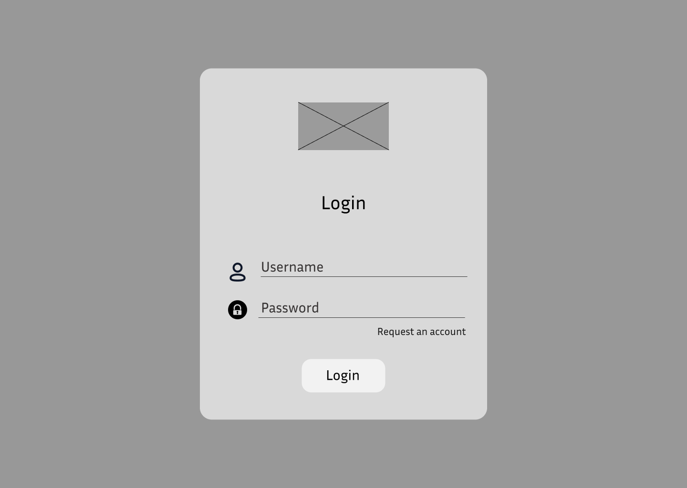 | 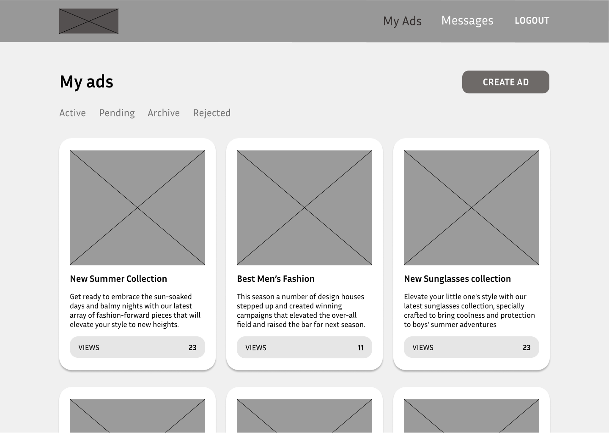 | 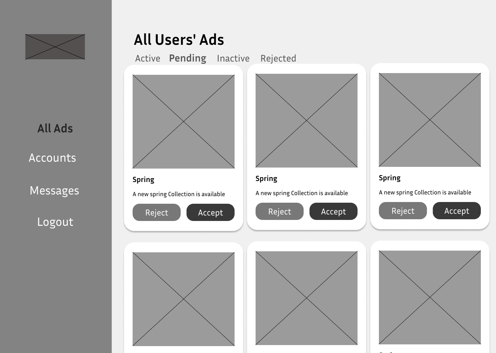 |

### Mockups
| Login screen  | User Main Page | Admin Main Page |
| ---| ---| ---|
| 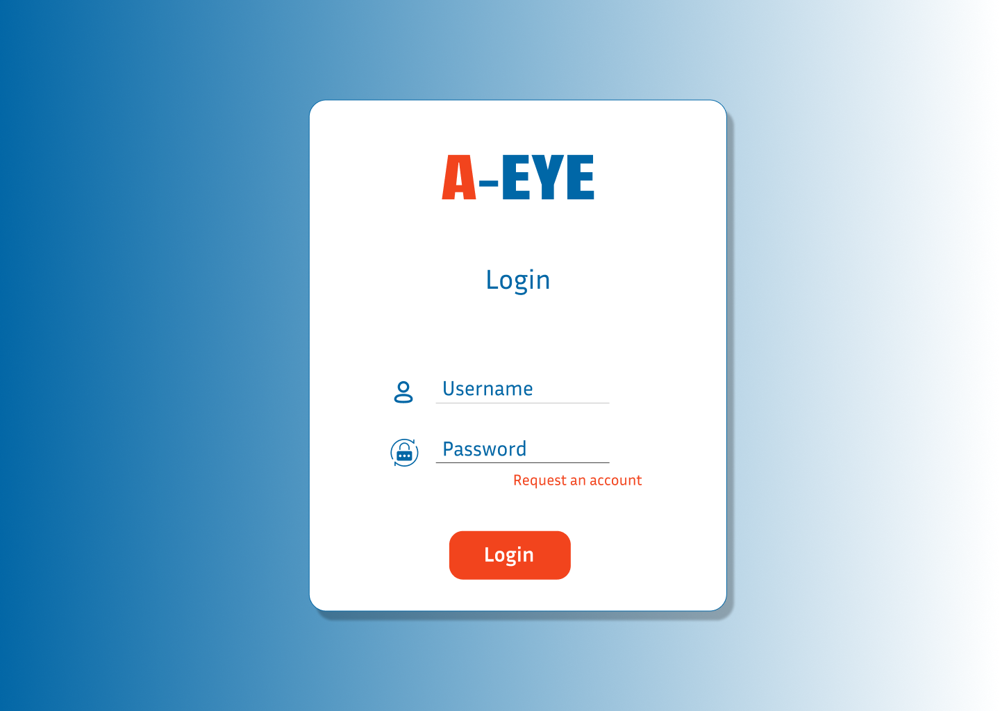 | 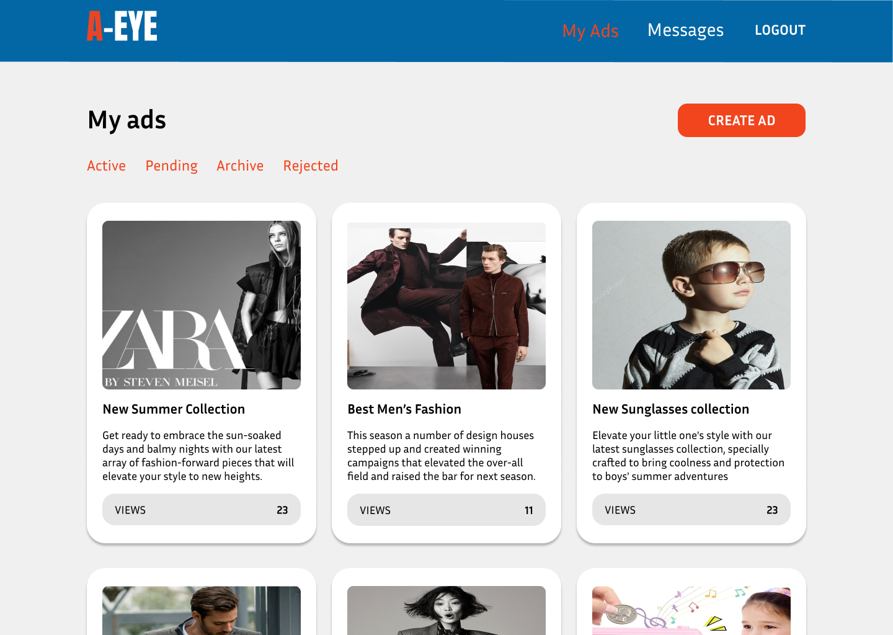 | 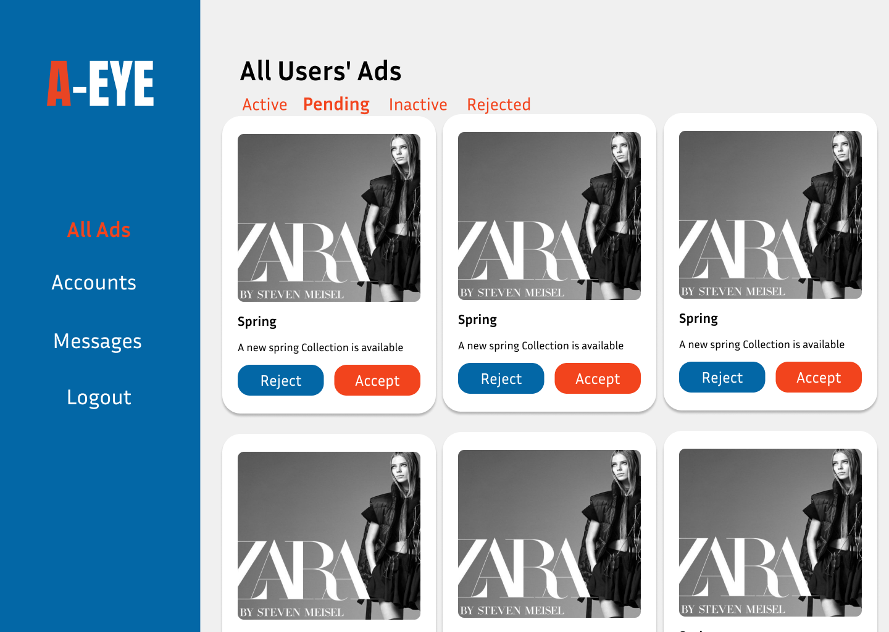 |

<br><br>

<!-- Implementation -->


> Using the wireframes and mockups as a guide, we implemented the A-Eye with the following features:


### User Screens 
| | Background Video | |
| ---| ---| ---|
| |  | |

| | Landing Page | |
| ---| ---| ---|
| |  | |

|| Create Advertisement |  Delete Request  |
| ---| ---| ---|
|  |  | 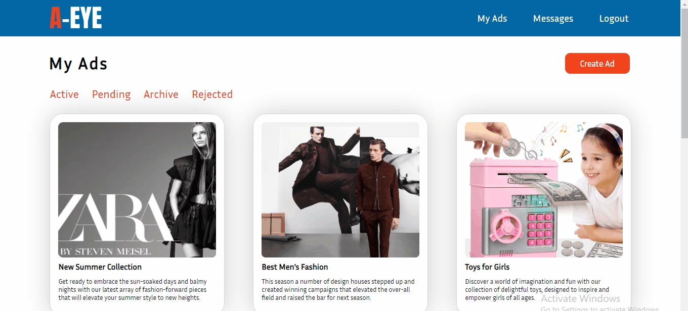 |

|| Deactivate Advertisement |  Request Archived Ad  |
| ---| ---| ---|
|  |  | 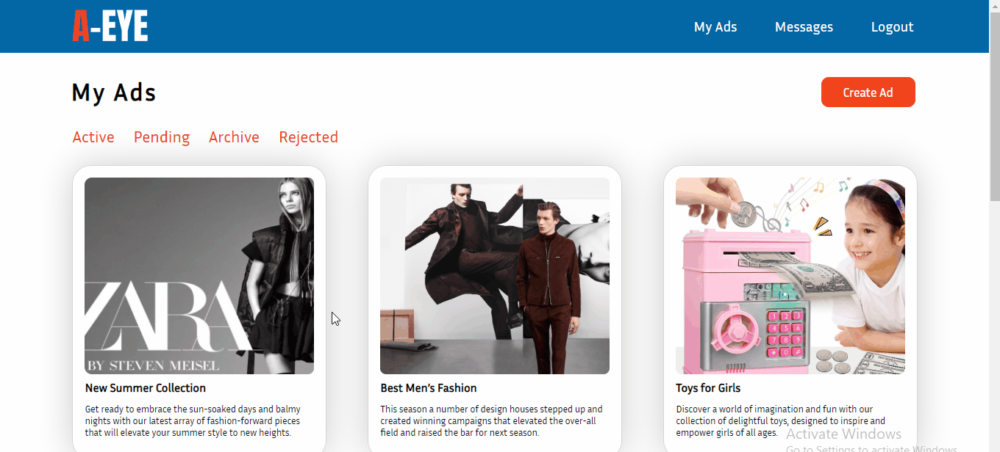 |

|| Rejected Requests |  Read Messages  |
| ---| ---| ---|
|  |  | 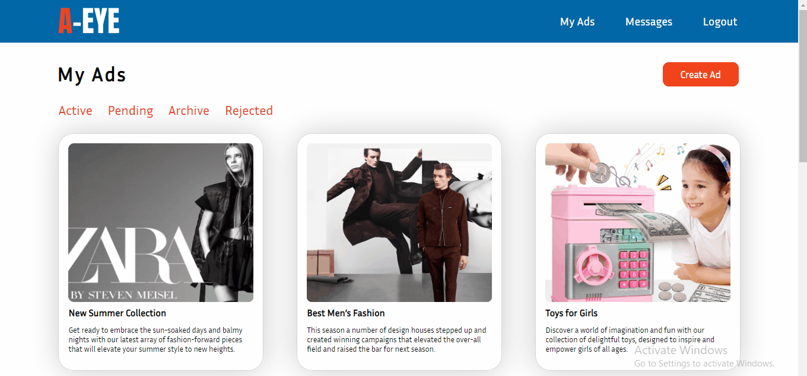 |

### Admin Screens 
| | Accept or Reject user requests | Deactivate Advertisement |
| ---| ---| ---|
| |  | 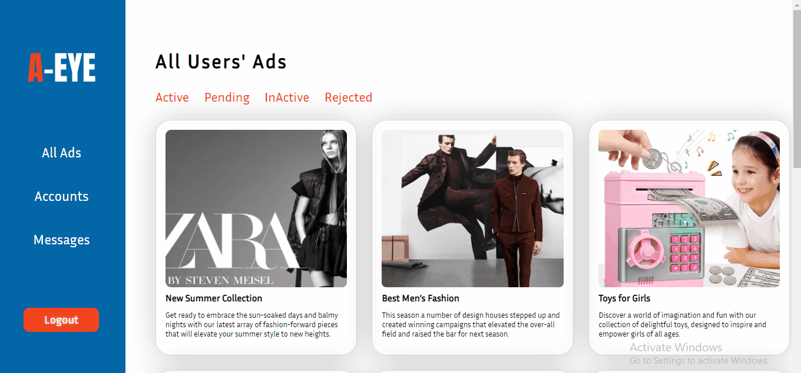 |

| | Inacitve and Rejected Ads | Send Message |
| ---| ---| ---|
| |  | 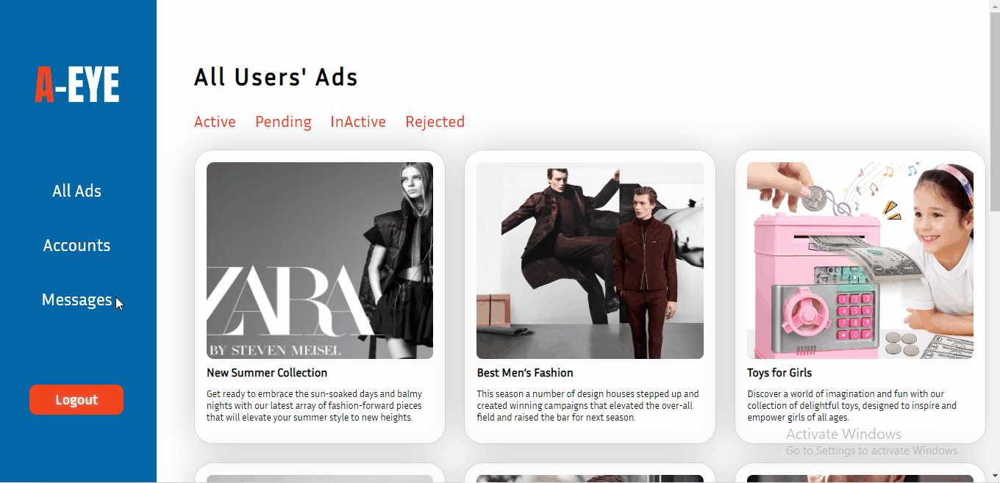 |

| | Create User | Activate or Deactivate User |
| ---| ---| ---|
| | 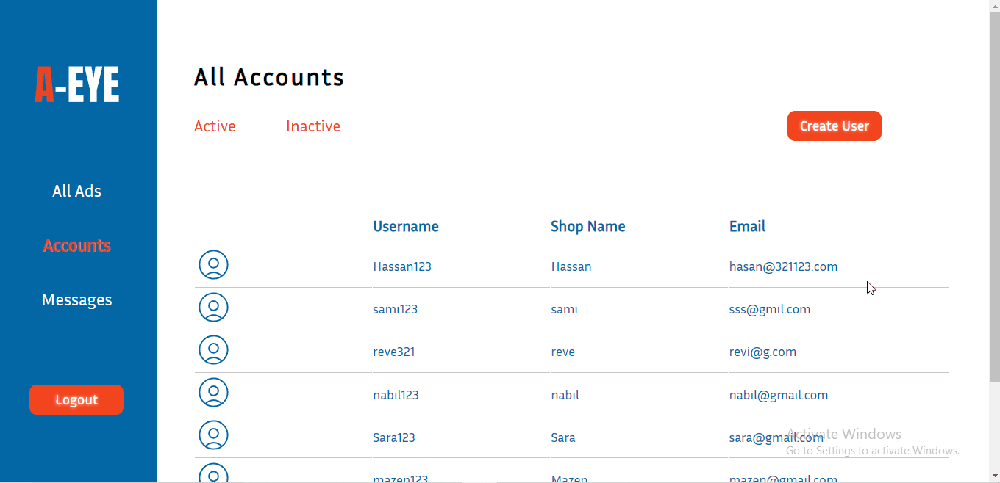 |  |

### Detecting and Analyzing faces - Gender & Age 
| | Running Related Advertisements | |
| ---| ---| ---|
| |  | |


<br><br>

<!-- Tech stack -->


###  A-Eye is built using the following technologies:

- This project uses python - OpenCV library to analyze faces and give back results in order to run targeted ads,
OpenCV is an open source library that provides a rich set of functions and algorithms for tasks such as image manipulation, feature detection, and more.
- This project uses Node.js as a backend language for building website functionalities, Node.js is a server-side JavaScript runtime environment known for its event-driven architecture and scalability in handling concurrent requests.
- MongoDb was used as database.
- A-Eye uses React Library for the frontend. React offers efficient and reusable component-based development, making it easier to build interactive and dynamic user interfaces for web applications.

<br><br>

<!-- How to run -->


> To start A-Eye locally, follow these steps:

### Prerequisites

* Ensure that you have Node.js installed on your system.
* Ensure that you have MongoDB installed on your system.
* Ensure that you have OpenCV installed on your system.

### Installation

1.  Clone the repo
   git clone https://github.com/hassan-zein-aldeen/A-eye
   ```
2. npm install
3. npm install nodemon mongoose
4. nodemon .

- frontend "React"
5. npm start 


Now, you should be able to run A-Eye locally and explore its features.